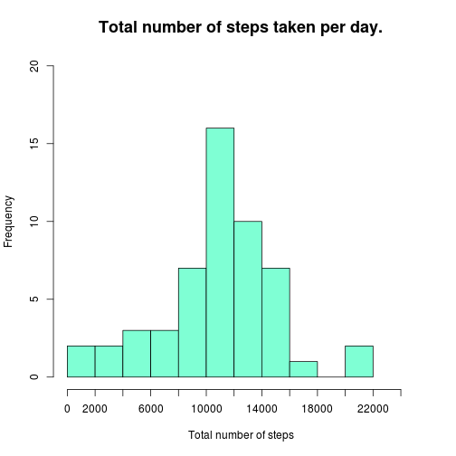
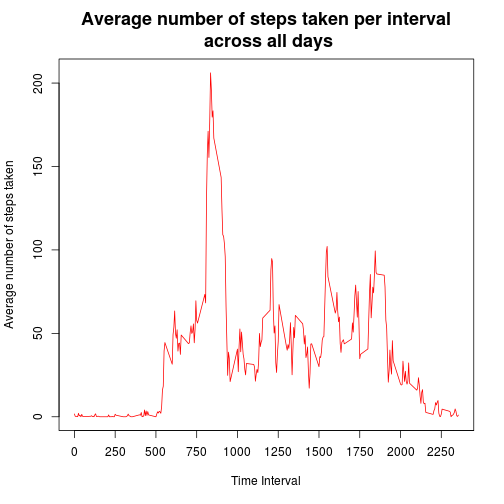

# Reproducible research
#### "Peer Assessment 1"

# Loading and preprocessing the data


```r
# reading/loading data
data <- read.csv("activity.csv")
# data with missing values
head(data)
```

```
##   steps       date interval
## 1    NA 2012-10-01        0
## 2    NA 2012-10-01        5
## 3    NA 2012-10-01       10
## 4    NA 2012-10-01       15
## 5    NA 2012-10-01       20
## 6    NA 2012-10-01       25
```

# What is mean total number of steps taken per day?

**Calculate the total number of steps taken per day**

```r
# ignoring missing values entry
noMissingValues <- data[complete.cases(data), ]

## data without missing data
head(noMissingValues)
```

```
##     steps       date interval
## 289     0 2012-10-02        0
## 290     0 2012-10-02        5
## 291     0 2012-10-02       10
## 292     0 2012-10-02       15
## 293     0 2012-10-02       20
## 294     0 2012-10-02       25
```

```r
totalStepsPerDay <- aggregate(noMissingValues$steps,
                           by = list(noMissingValues$date),
                           sum
                           )
colnames(totalStepsPerDay) <- c("Date", "TotalSteps")
totalStepsPerDay
```

```
##          Date TotalSteps
## 1  2012-10-02        126
## 2  2012-10-03      11352
## 3  2012-10-04      12116
## 4  2012-10-05      13294
## 5  2012-10-06      15420
## 6  2012-10-07      11015
## 7  2012-10-09      12811
## 8  2012-10-10       9900
## 9  2012-10-11      10304
## 10 2012-10-12      17382
## 11 2012-10-13      12426
## 12 2012-10-14      15098
## 13 2012-10-15      10139
## 14 2012-10-16      15084
## 15 2012-10-17      13452
## 16 2012-10-18      10056
## 17 2012-10-19      11829
## 18 2012-10-20      10395
## 19 2012-10-21       8821
## 20 2012-10-22      13460
## 21 2012-10-23       8918
## 22 2012-10-24       8355
## 23 2012-10-25       2492
## 24 2012-10-26       6778
## 25 2012-10-27      10119
## 26 2012-10-28      11458
## 27 2012-10-29       5018
## 28 2012-10-30       9819
## 29 2012-10-31      15414
## 30 2012-11-02      10600
## 31 2012-11-03      10571
## 32 2012-11-05      10439
## 33 2012-11-06       8334
## 34 2012-11-07      12883
## 35 2012-11-08       3219
## 36 2012-11-11      12608
## 37 2012-11-12      10765
## 38 2012-11-13       7336
## 39 2012-11-15         41
## 40 2012-11-16       5441
## 41 2012-11-17      14339
## 42 2012-11-18      15110
## 43 2012-11-19       8841
## 44 2012-11-20       4472
## 45 2012-11-21      12787
## 46 2012-11-22      20427
## 47 2012-11-23      21194
## 48 2012-11-24      14478
## 49 2012-11-25      11834
## 50 2012-11-26      11162
## 51 2012-11-27      13646
## 52 2012-11-28      10183
## 53 2012-11-29       7047
```

**Make a histogram of the total number of steps taken each day**

```r
hist(totalStepsPerDay$TotalSteps,
     breaks = 10,
     xaxt = "n",
     ylim = c(0, 20),
     xlim = c(0, 25000),
     xlab = "Total number of steps",
     main = "Total number of steps taken per day.",
     col = "aquamarine",
     cex.main = 1.5,
     cex.axis = 1)

axis(side = 1,
     at=seq(0, 25000, 2000),
     labels = seq(0, 25000, 2000)
     )
```

 

Mean of total number of steps taken per day

```r
meanStepsPerDay = aggregate(
                  noMissingValues$steps,
                  by = list(noMissingValues$date),
                  mean,
                  na.rm = TRUE
                  )
colnames(meanStepsPerDay) <- c("Date", "MeanSteps")
meanStepsPerDay
```

```
##          Date  MeanSteps
## 1  2012-10-02  0.4375000
## 2  2012-10-03 39.4166667
## 3  2012-10-04 42.0694444
## 4  2012-10-05 46.1597222
## 5  2012-10-06 53.5416667
## 6  2012-10-07 38.2465278
## 7  2012-10-09 44.4826389
## 8  2012-10-10 34.3750000
## 9  2012-10-11 35.7777778
## 10 2012-10-12 60.3541667
## 11 2012-10-13 43.1458333
## 12 2012-10-14 52.4236111
## 13 2012-10-15 35.2048611
## 14 2012-10-16 52.3750000
## 15 2012-10-17 46.7083333
## 16 2012-10-18 34.9166667
## 17 2012-10-19 41.0729167
## 18 2012-10-20 36.0937500
## 19 2012-10-21 30.6284722
## 20 2012-10-22 46.7361111
## 21 2012-10-23 30.9652778
## 22 2012-10-24 29.0104167
## 23 2012-10-25  8.6527778
## 24 2012-10-26 23.5347222
## 25 2012-10-27 35.1354167
## 26 2012-10-28 39.7847222
## 27 2012-10-29 17.4236111
## 28 2012-10-30 34.0937500
## 29 2012-10-31 53.5208333
## 30 2012-11-02 36.8055556
## 31 2012-11-03 36.7048611
## 32 2012-11-05 36.2465278
## 33 2012-11-06 28.9375000
## 34 2012-11-07 44.7326389
## 35 2012-11-08 11.1770833
## 36 2012-11-11 43.7777778
## 37 2012-11-12 37.3784722
## 38 2012-11-13 25.4722222
## 39 2012-11-15  0.1423611
## 40 2012-11-16 18.8923611
## 41 2012-11-17 49.7881944
## 42 2012-11-18 52.4652778
## 43 2012-11-19 30.6979167
## 44 2012-11-20 15.5277778
## 45 2012-11-21 44.3993056
## 46 2012-11-22 70.9270833
## 47 2012-11-23 73.5902778
## 48 2012-11-24 50.2708333
## 49 2012-11-25 41.0902778
## 50 2012-11-26 38.7569444
## 51 2012-11-27 47.3819444
## 52 2012-11-28 35.3576389
## 53 2012-11-29 24.4687500
```

Median of total number of steps taken per day

```r
medianStepsPerDay = aggregate(
                  noMissingValues$steps,
                  by = list(noMissingValues$date),
                  median,
                  na.rm = TRUE
                  )
colnames(medianStepsPerDay) <- c("Date", "MedianSteps")
medianStepsPerDay
```

```
##          Date MedianSteps
## 1  2012-10-02           0
## 2  2012-10-03           0
## 3  2012-10-04           0
## 4  2012-10-05           0
## 5  2012-10-06           0
## 6  2012-10-07           0
## 7  2012-10-09           0
## 8  2012-10-10           0
## 9  2012-10-11           0
## 10 2012-10-12           0
## 11 2012-10-13           0
## 12 2012-10-14           0
## 13 2012-10-15           0
## 14 2012-10-16           0
## 15 2012-10-17           0
## 16 2012-10-18           0
## 17 2012-10-19           0
## 18 2012-10-20           0
## 19 2012-10-21           0
## 20 2012-10-22           0
## 21 2012-10-23           0
## 22 2012-10-24           0
## 23 2012-10-25           0
## 24 2012-10-26           0
## 25 2012-10-27           0
## 26 2012-10-28           0
## 27 2012-10-29           0
## 28 2012-10-30           0
## 29 2012-10-31           0
## 30 2012-11-02           0
## 31 2012-11-03           0
## 32 2012-11-05           0
## 33 2012-11-06           0
## 34 2012-11-07           0
## 35 2012-11-08           0
## 36 2012-11-11           0
## 37 2012-11-12           0
## 38 2012-11-13           0
## 39 2012-11-15           0
## 40 2012-11-16           0
## 41 2012-11-17           0
## 42 2012-11-18           0
## 43 2012-11-19           0
## 44 2012-11-20           0
## 45 2012-11-21           0
## 46 2012-11-22           0
## 47 2012-11-23           0
## 48 2012-11-24           0
## 49 2012-11-25           0
## 50 2012-11-26           0
## 51 2012-11-27           0
## 52 2012-11-28           0
## 53 2012-11-29           0
```


# What is the average daily activity pattern?
**1. Make a time series plot (i.e. type = "l") of the 5-minute interval (x-axis) and the average number of steps taken, averaged across all days (y-axis)**


```r
## averaging steps per interval
avgStepsPerTimeInterval <- aggregate(
                                  noMissingValues$steps,
                                  by = list(noMissingValues$interval),
                                  mean,
                                  na.rm = TRUE
                                  )
colnames(avgStepsPerTimeInterval) <- c("TimeInterval", "AverageSteps")
## plotting graph
plot(avgStepsPerTimeInterval$TimeInterval,
     avgStepsPerTimeInterval$AverageSteps,
     type = "l",
     xlab = "Time Interval",
     ylab = "Average number of steps taken",
     main =  "Average number of steps taken per interval\n across all days",
     cex.main = 1.5,
     cex.axis = 1.0,
     col = "red",
     xaxt = "n"
     )

axis(side = 1,
     at=seq(0, 2500, 250),
     labels = seq(0, 2500, 250)
     )
```

 


**2. Which 5-minute interval, on average across all the days in the dataset, contains the maximum number of steps?**


```r
# From the graph it can be seen that somewhere between 800 to 1000 there is a peak.
# The exact value can be found by following code
max(avgStepsPerTimeInterval$AverageSteps)
```

```
## [1] 206.1698
```

```r
#and interval is
avgStepsPerTimeInterval[which.max(avgStepsPerTimeInterval$AverageSteps), "TimeInterval"]
```

```
## [1] 835
```


#Imputing missing values

**Note that there are a number of days/intervals where there are missing values (coded as NA). The presence of missing days may introduce bias into some calculations or summaries of the data.**
**1. Calculate and report the total number of missing values in the dataset (i.e. the total number of rows with NAs)**


```r
# return true if any of value in this list is NA
filterFunction <- function(x) {
  return(ifelse(any(is.na(x)), TRUE,  FALSE))
}
# will apply above filterFunction across all rows of data
naRows <- apply(data, 1, filterFunction)
# Total number of rows with nas / rows with missing values
sum(naRows)
```

```
## [1] 2304
```

**2. Devise a strategy for filling in all of the missing values in the dataset. The strategy does not need to be sophisticated. For example, you could use the mean/median for that day, or the mean for that 5-minute interval, etc.**

**Strategy:**
  
  1) Merge the original data (with NA) with the created data having averageStepsPerTimeInterval
2) Merged data will have following features :
  c(interval, steps(will have NAs), date, AverageSteps)
3) Find out the rows having NA values from mergedData calculated in previos step.
4) Replace values of "steps" by values in "AverageSteps" where NA is present.


```r
## step 1
mergedData <- merge(data, avgStepsPerTimeInterval, by.x = "interval", by.y="TimeInterval")

## step 3
# finding rows having NAs
naRows <- apply(mergedData, 1, filterFunction)

## step4
#copying average steps value into steps if steps == NA
mergedData[naRows, 2] <- mergedData[naRows, 4]
```

**3.Create a new dataset that is equal to the original dataset but with the missing data filled in.**

```r
refinedData <- mergedData[,1:3]

## refined data
head(refinedData)
```

```
##   interval    steps       date
## 1        0 1.716981 2012-10-01
## 2        0 0.000000 2012-11-23
## 3        0 0.000000 2012-10-28
## 4        0 0.000000 2012-11-06
## 5        0 0.000000 2012-11-24
## 6        0 0.000000 2012-11-15
```

**4. Make a histogram of the total number of steps taken each day and Calculate and report the mean and median total number of steps taken per day.**


```r
totalStepsTakenPerDay <- aggregate(refinedData$steps,
                                   by = list(refinedData$date),
                                   sum)
colnames(totalStepsTakenPerDay) <- c("Date", "TotalSteps")
hist(totalStepsTakenPerDay$TotalSteps,
     xlab = "Total steps taken",
     main = "Total steps taken per day",
     col= "cyan",
     cex.main = 1.5,
     cex.axis = 1,
     breaks = 10,
     xaxt = "n",
     xlim = c(0, 25000),
     ylim = c(0, 25)
     )

axis(side = 1,
     at=seq(0, 25000, 2000),
     labels = seq(0, 25000, 2000)
     )
```

 


**Calculate and report the mean**

```r
meanStepsPerDay <- aggregate(
                             refinedData$steps,
                             by = list(refinedData$date),
                             mean)
colnames(meanStepsPerDay) <- c("Date", "MeanSteps")
meanStepsPerDay
```

```
##          Date  MeanSteps
## 1  2012-10-01 37.3825996
## 2  2012-10-02  0.4375000
## 3  2012-10-03 39.4166667
## 4  2012-10-04 42.0694444
## 5  2012-10-05 46.1597222
## 6  2012-10-06 53.5416667
## 7  2012-10-07 38.2465278
## 8  2012-10-08 37.3825996
## 9  2012-10-09 44.4826389
## 10 2012-10-10 34.3750000
## 11 2012-10-11 35.7777778
## 12 2012-10-12 60.3541667
## 13 2012-10-13 43.1458333
## 14 2012-10-14 52.4236111
## 15 2012-10-15 35.2048611
## 16 2012-10-16 52.3750000
## 17 2012-10-17 46.7083333
## 18 2012-10-18 34.9166667
## 19 2012-10-19 41.0729167
## 20 2012-10-20 36.0937500
## 21 2012-10-21 30.6284722
## 22 2012-10-22 46.7361111
## 23 2012-10-23 30.9652778
## 24 2012-10-24 29.0104167
## 25 2012-10-25  8.6527778
## 26 2012-10-26 23.5347222
## 27 2012-10-27 35.1354167
## 28 2012-10-28 39.7847222
## 29 2012-10-29 17.4236111
## 30 2012-10-30 34.0937500
## 31 2012-10-31 53.5208333
## 32 2012-11-01 37.3825996
## 33 2012-11-02 36.8055556
## 34 2012-11-03 36.7048611
## 35 2012-11-04 37.3825996
## 36 2012-11-05 36.2465278
## 37 2012-11-06 28.9375000
## 38 2012-11-07 44.7326389
## 39 2012-11-08 11.1770833
## 40 2012-11-09 37.3825996
## 41 2012-11-10 37.3825996
## 42 2012-11-11 43.7777778
## 43 2012-11-12 37.3784722
## 44 2012-11-13 25.4722222
## 45 2012-11-14 37.3825996
## 46 2012-11-15  0.1423611
## 47 2012-11-16 18.8923611
## 48 2012-11-17 49.7881944
## 49 2012-11-18 52.4652778
## 50 2012-11-19 30.6979167
## 51 2012-11-20 15.5277778
## 52 2012-11-21 44.3993056
## 53 2012-11-22 70.9270833
## 54 2012-11-23 73.5902778
## 55 2012-11-24 50.2708333
## 56 2012-11-25 41.0902778
## 57 2012-11-26 38.7569444
## 58 2012-11-27 47.3819444
## 59 2012-11-28 35.3576389
## 60 2012-11-29 24.4687500
## 61 2012-11-30 37.3825996
```

**Calculate and report the median**

```r
medianStepsPerDay <- aggregate(
                             refinedData$steps,
                             by = list(refinedData$date),
                             median)
colnames(medianStepsPerDay) <- c("Date", "MedianSteps")
medianStepsPerDay
```

```
##          Date MedianSteps
## 1  2012-10-01    34.11321
## 2  2012-10-02     0.00000
## 3  2012-10-03     0.00000
## 4  2012-10-04     0.00000
## 5  2012-10-05     0.00000
## 6  2012-10-06     0.00000
## 7  2012-10-07     0.00000
## 8  2012-10-08    34.11321
## 9  2012-10-09     0.00000
## 10 2012-10-10     0.00000
## 11 2012-10-11     0.00000
## 12 2012-10-12     0.00000
## 13 2012-10-13     0.00000
## 14 2012-10-14     0.00000
## 15 2012-10-15     0.00000
## 16 2012-10-16     0.00000
## 17 2012-10-17     0.00000
## 18 2012-10-18     0.00000
## 19 2012-10-19     0.00000
## 20 2012-10-20     0.00000
## 21 2012-10-21     0.00000
## 22 2012-10-22     0.00000
## 23 2012-10-23     0.00000
## 24 2012-10-24     0.00000
## 25 2012-10-25     0.00000
## 26 2012-10-26     0.00000
## 27 2012-10-27     0.00000
## 28 2012-10-28     0.00000
## 29 2012-10-29     0.00000
## 30 2012-10-30     0.00000
## 31 2012-10-31     0.00000
## 32 2012-11-01    34.11321
## 33 2012-11-02     0.00000
## 34 2012-11-03     0.00000
## 35 2012-11-04    34.11321
## 36 2012-11-05     0.00000
## 37 2012-11-06     0.00000
## 38 2012-11-07     0.00000
## 39 2012-11-08     0.00000
## 40 2012-11-09    34.11321
## 41 2012-11-10    34.11321
## 42 2012-11-11     0.00000
## 43 2012-11-12     0.00000
## 44 2012-11-13     0.00000
## 45 2012-11-14    34.11321
## 46 2012-11-15     0.00000
## 47 2012-11-16     0.00000
## 48 2012-11-17     0.00000
## 49 2012-11-18     0.00000
## 50 2012-11-19     0.00000
## 51 2012-11-20     0.00000
## 52 2012-11-21     0.00000
## 53 2012-11-22     0.00000
## 54 2012-11-23     0.00000
## 55 2012-11-24     0.00000
## 56 2012-11-25     0.00000
## 57 2012-11-26     0.00000
## 58 2012-11-27     0.00000
## 59 2012-11-28     0.00000
## 60 2012-11-29     0.00000
## 61 2012-11-30    34.11321
```

**Do these values differ from the estimates from the first part of the assignment? What is the impact of imputing missing data on the estimates of the total daily number of steps?**


**Total Number of steps**

In first case, I ignored (to be more precise I removed it) missing values due to which for some days total number of steps taken were not available.
But later when I replaced missing entries (NAs) with average value of corresponding time interval, data for all dates was present. There is a rise in the total number of steps taken in range of 10000-12000.


**Mean**

Again, in this case too, values for all dates are now available.
However, there isn't any significant change in mean value.


**Median**

Again, in this case too, values for all dates are now available.
In earlier case all values were 0. But now there are some values for some dates. These dates are same for which mean values were imputed.


#Are there differences in activity patterns between weekdays and weekends?


**Create a new factor variable in the dataset with two levels – “weekday” and “weekend” indicating whether a given date is a weekday or weekend day.**

Added another factor variable with name as "DayType"


```r
## converted date from factor to date
refinedData$Date <- as.Date(refinedData$date, format = "%Y-%m-%d")

## Following method returns the type of day
getDayType <- function(x) {
  return(ifelse((x == "Sunday" | x == "Saturday"), "Weekend", "Weekday"))
}

weekDayType <- sapply(weekdays(refinedData$Date), getDayType)
refinedData <- cbind(refinedData, "WeekDayType" = weekDayType)
```

**Make a panel plot containing a time series plot (i.e. type = "l") of the 5-minute interval (x-axis) and the average number of steps taken, averaged across all weekday days or weekend days (y-axis). See the README file in the GitHub repository to see an example of what this plot should look like using simulated data.**


```r
library(lattice)
avgStepsByWeekDays <- aggregate(
                      refinedData$steps,
                      by = list(refinedData$interval, refinedData$WeekDayType),
                      mean)
colnames(avgStepsByWeekDays) <- c("Interval", "WeekType", "AverageNumberOfSteps")
xyplot(AverageNumberOfSteps ~ Interval | WeekType,
       data = avgStepsByWeekDays,
       type = "l",
       layout=c(1, 2)
       )
```

 

Yes, there is a difference between activity patterns between weekdays and weekends.

**1.** On weekdays the number of steps taken is more between 7:30 am to 8:30 am (probably rushing towards office ;) )

**2.** From the graph it is evident that person is active for longer time on weekend.

**3.** No steps taken in beginning may be due to the fact that he is sleeping.
